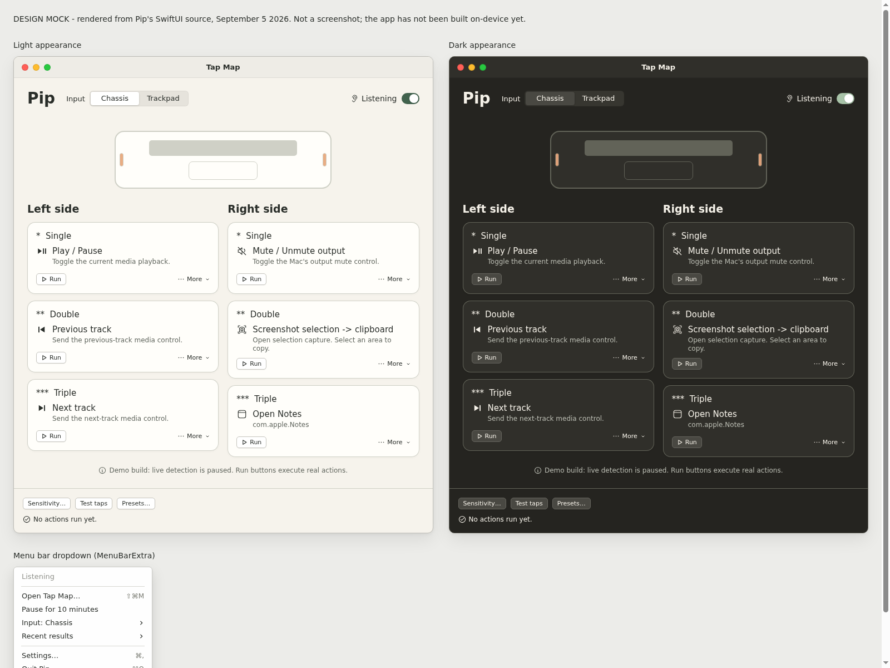
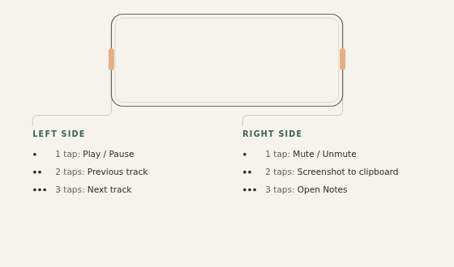

# Pip

A little tap. Just what you wanted.

Pip is a macOS menu-bar app that turns taps on the side of your MacBook into actions.
Tap the left edge once to pause the music, twice for the previous track, three times
for the next. Tap the right edge to mute, take a screenshot, or run any Apple Shortcut.
Six slots in total: left and right, single, double and triple.

The detection engine is [Bump](https://github.com/Roshan-Rengadurai/bump) (MIT,
vendored in `Vendor/Bump/`). Pip is the product around it: the tap map, the actions,
the feedback.

<p align="center">
  
  <br />
  <sub>Design mock of the Tap Map and menu-bar dropdown, rendered from the SwiftUI source.</sub>
</p>


## Status

Early milestone (M1). What works today:

- The Tap Map editor: six slots, an action picker, presets, and persistence.
- Run buttons on every card, so actions can be triggered without a physical tap.
- The menu-bar item with listening state, pause, and recent results.

What is not connected yet:

- Live sensor input. The app ships with a clearly labeled demo source, so listening
  stays paused and the header says so. The engine bridge lands in M2 on real hardware.
- The quiet tap sound. The toggle is visible but disabled until the tick asset exists.

There is no release build and no in-app onboarding. This README is the onboarding.

## Requirements

- macOS 14 (Sonoma) or later.
- An Apple Silicon MacBook for chassis taps. The sensor is probed at runtime; if it
  is unavailable, trackpad mode is the fallback (hold Option and tap), and it stays
  unavailable until its hit regions are verified.
- A Swift 5.10 toolchain. Xcode 15 or later works; the Command Line Tools are enough.

## Build and run

```
git clone https://github.com/abhaymettu/pip-mac.git
cd pip-mac
swift build --arch arm64
swift run Pip
```

Pip appears as two small contact marks in the menu bar and opens the Tap Map window.
There is no Dock icon.

SwiftPM does not produce a signed `.app` bundle, so a `swift run` build is a
development build: macOS treats it as your terminal's child for permissions, and a
packaged, signed app (with stable permission identity and login launch) comes later.
If a permission below seems to stick to the wrong thing, that is why.

## Setup

Five minutes, six steps. No account, no network, nothing leaves the Mac.

<p align="center">
  
  <br />
  <sub>The two tap zones and the Everyday preset they start with.</sub>
</p>

### 1. Grant the two permissions

Pip needs exactly two macOS permissions, and each has one job:

| Permission | Why Pip needs it |
|---|---|
| Input Monitoring | So Pip can ignore your taps while you type, and so trackpad input works. |
| Accessibility | So Pip can send media keys and keyboard shortcuts to other apps. |

Open the menu-bar item, choose **Settings…**, and use the **Input Monitoring
settings…** and **Accessibility settings…** buttons. Each opens the right System
Settings pane. Allow Pip (or your terminal, while running via `swift run`).

Pip does not save what you type. Input activity is used only to suppress accidental
gestures.

If you change a permission and Pip still cannot listen, quit and reopen it. macOS
sometimes needs a fresh process before a permission change takes effect, especially
across rebuilds.

You can skip both permissions and still build your map. Listening stays paused until
they are granted and the engine is connected.

### 2. Learn what a tap feels like

Open the Tap Map and click **Test taps** in the bottom strip. Physical taps highlight
their card but run nothing, so you can find a gentle touch safely. Pip listens for a
tap, not a knock.

One thing to know: Pip waits a short beat to tell one tap from two or three. A single
tap fires a moment after you make it. That pause is the price of doubles and triples,
and it is normal.

### 3. Start with a preset

Click **Presets…** and pick a starting map. **Everyday** is the sensible default.

| Gesture | Everyday | Quiet desk | Shortcut canvas |
|---|---|---|---|
| Left · Single | Play / Pause | Play / Pause | Unassigned |
| Left · Double | Previous track | Volume down | Unassigned |
| Left · Triple | Next track | Volume up | Unassigned |
| Right · Single | Mute / Unmute output | Mute / Unmute output | Unassigned |
| Right · Double | Screenshot selection → clipboard | Open Calendar | Unassigned |
| Right · Triple | Open Notes | Open Notes | Choose a Shortcut… |

Applying a preset replaces all six current assignments. Singles stay reversible and
low-stakes on purpose; nothing in a preset locks the screen, runs a script, or
messages anyone. Shortcut canvas is an empty starting point, not six automations you
did not choose.

### 4. Make one slot yours

Click any card to open the action picker. You can assign:

- **Mac controls.** Media keys, volume, mute, screenshot to clipboard, open Notes or
  Calendar. These assign in one click.
- **Apple Shortcuts.** Pick from the discovered list, or **Enter exact name…**.
  Names are matched exactly, capitalization and spaces included. Pip never substitutes
  a similar Shortcut, so if you rename one, reassign the binding.
- **Open app or URL.** An application chooser, or a full address including its scheme.
- **Keyboard shortcut.** A recorder captures the modifiers and key, sent to whichever
  app is frontmost when you tap.
- **Shell script.** Under Advanced. Runs via `/bin/zsh -c` with your account's
  permissions, a chosen working directory, and a timeout. Only assign code you
  understand.

Every card also has a **Run** button, which executes the action immediately without a
physical tap, and an overflow menu for **Change…**, **Duplicate to…**, and **Clear**.

### 5. Tune the sensitivity

Click **Sensitivity…** for one slider (firmer taps to lighter taps), per-side tuning,
side swapping, and a typing-protection toggle. Leave typing protection on.

If taps are not registering, try a slightly lighter setting. If desk bumps or typing
trigger actions, go firmer. A conservative setting that misses the occasional light
tap is better than a sensitive one that fires while you type.

These controls apply through the engine bridge. Until it is connected they are shown
but cannot change the detector, and the sheet says so.

### 6. Start listening

Flip the switch in the Tap Map header. The menu-bar glyph shows state at a glance:
plain marks while listening, a slash while paused, an added mark after a failure.

From the menu-bar item you can pause for 10 minutes, resume, switch input mode, see
the most recent failure, and open recent results. Pause is always one click away.

## Where things are stored

Everything lives in `~/Library/Application Support/Pip/`:

- `configuration.json` - the core bindings and input mode.
- `ui-state.json` - your assignments, preset choices, and sensitivity settings.

Both are plain JSON. Quit Pip before editing them by hand.

## Privacy

Pip is local only. No accounts, no analytics, no telemetry, no network service.
Typed text is never saved or logged. Shortcut output and script output are shown as
results and then discarded, not written to a permanent log.

## Troubleshooting

- **A permission looks granted but Pip cannot listen.** Quit and reopen Pip. If you
  rebuilt the app, macOS may have attached the permission to the old binary.
- **A Shortcut binding stopped working.** You probably renamed or deleted the
  Shortcut. Reassign the slot with the new exact name.
- **Taps fire while typing.** Turn typing protection back on, choose a firmer
  sensitivity, and prefer double or triple taps for anything destructive.
- **Chassis taps do nothing.** The sensor probe may have failed. That is not a
  verdict on your Mac; check the input selector and try trackpad mode once it is
  marked available.
- **The map is fine but nothing listens.** In this milestone the live engine bridge
  is not connected, and the app says so rather than pretending.

## Repository layout

```
Package.swift          SwiftPM manifest (macOS 14+, Swift 5.10)
Sources/
  PipApp/              App shell: lifecycle, menu bar, windows
  PipUI/               Tap Map, action picker, sensitivity, theme
  PipDomain/           Models and routing rules (no AppKit, no sensors)
  PipActions/          Executors, Shortcuts discovery, process management
  PipPersistence/      Config store, migrations, preset packs
  PipEngineAdapter/    Bump translation, replay source, diagnostics
Vendor/Bump/           The MIT detection engine, pinned and unmodified
Resources/Presets/     Versioned preset pack JSON
DESIGN.md              The design spec: decisions, milestones, risks
```

`PipDomain` compiles without AppKit or sensor access, and the UI never imports
vendor types. A replay source makes the whole app demonstrable without hardware.

## Credits

Pip vendors the detection engine from [Bump](https://github.com/Roshan-Rengadurai/bump)
by Roshan Rengadurai, MIT licensed. See `Vendor/Bump/LICENSE` and `Vendor/UPSTREAM.md`.

